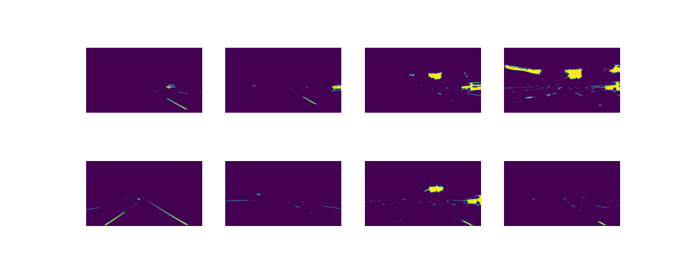
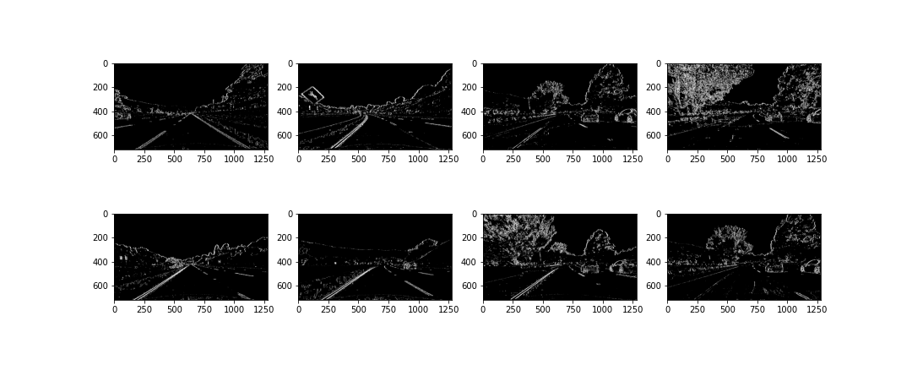
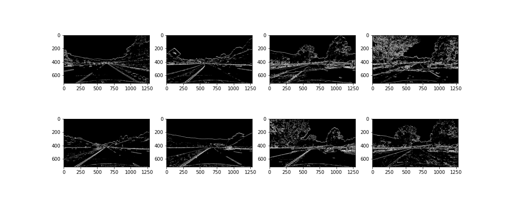
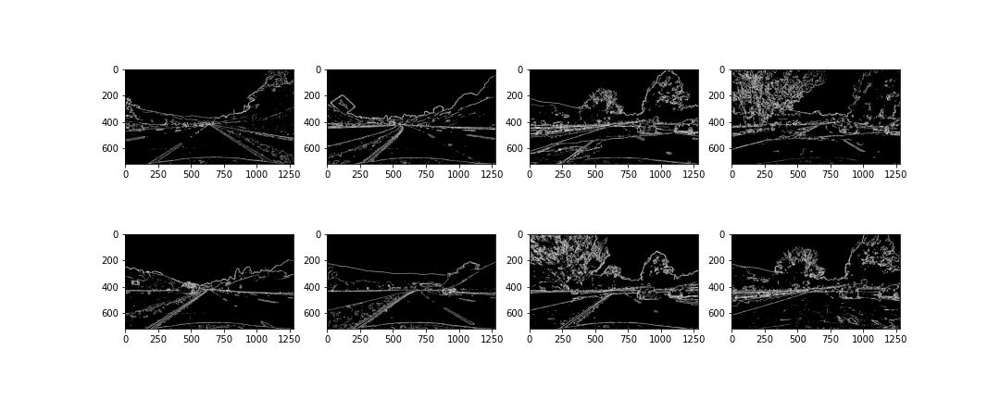
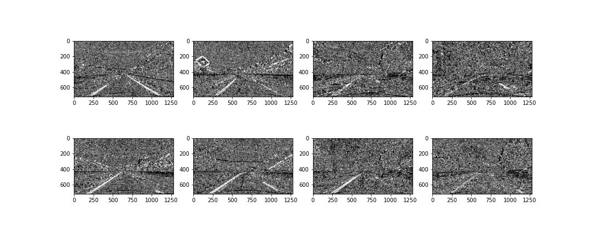
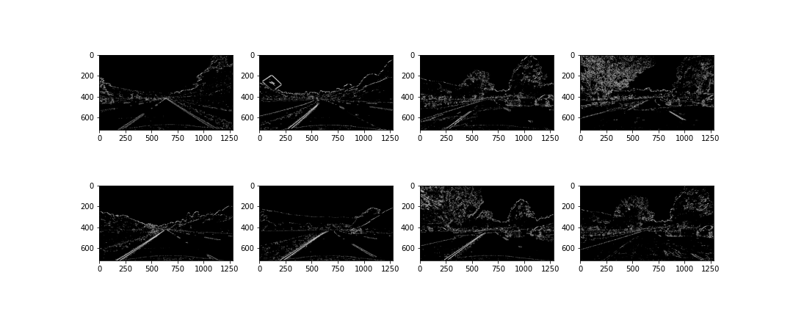
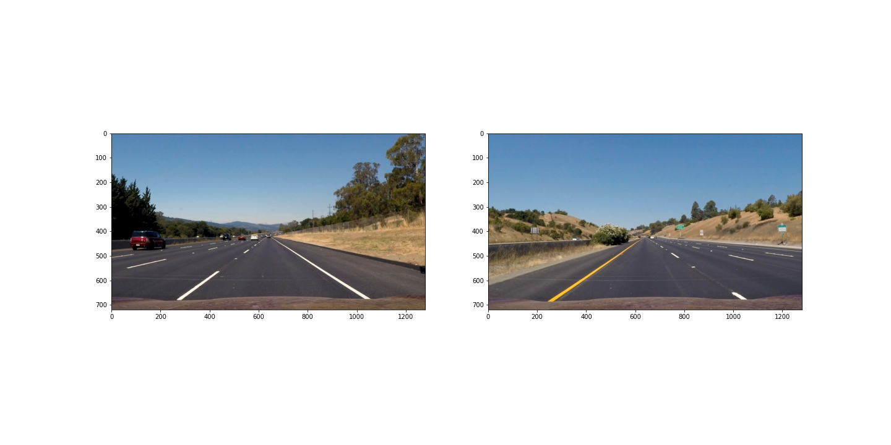

# **Lane Finding Project**

The goal of this project is to create a powerful pipeline to detect lane lines with raw images from a car's dash cam. The pipeline will visually display the lane boundaries, numerically giving a numerical estimate of the lane curvature.

# Dependencies 

**To execute the pipeline, the following dependencies are necessary :**

- numpy
- cv2
- glob
- matplotlib
- moviepy.editor

# The Project

**The goals / steps of this project are the following :**

- Compute the camera calibration matrix and distortion coefficients given a set of chessboard images.
- Apply a distortion correction to raw images.
- Use color transforms, gradients, etc., to create a thresholded binary image.
- Apply a perspective transform to rectify binary image ("birds-eye view").
- Detect lane pixels and fit to find the lane boundary.
- Determine the curvature of the lane and vehicle position with respect to center.
- Warp the detected lane boundaries back onto the original image.
- Output visual display of the lane boundaries and numerical estimation of lane curvature and vehicle position.

**Overview of Files :**

My project includes the following files :

- <a href= "README.md">README.md</a> (writeup report) documentation of the results
- <a href= "Camera_Calibration.ipynb">Camera_Calibration.ipynb</a> code for calibration of the camera
- <a href= "Color_transform_&_Gradient_Threshold.ipynb">Color_transform_&_Gradient_Threshold.ipynb</a> code for correction of distortion & calculation of thresholds & Color transform
- <a href= "Perspective_Transformation.ipynb">Perspective_Transformation.ipynb</a> code for perspective transformation
- <a href= "Lane_Finding_Project.ipynb">Lane_Finding_Project.ipynb</a> Code for all the project  
- <a href= "project_video_final.mp4">project video result</a>

# Camera Calibration

Each camera has a certain lens that distorts the captured image in a certain way compared to reality. Because we want to capture the view of the surroundings as accurately as possible, we have to correct this distortion. OpenCV provides some very useful functions to accomplish this task.

The code for this step  in the file called <a href= "Camera_Calibration.ipynb">Camera_Calibration.ipynb</a>.

I start by preparing **"object points"**, which will be the (x, y, z) coordinates of the chessboard corners in the world. Here I am assuming the chessboard is fixed on the (x, y) plane at z=0, such that the object points are the same for each calibration image. Thus, **objp** is just a replicated array of coordinates, and **objpoints** will be appended with a copy of it every time I successfully detect all chessboard corners in a test image. To do so I use the **cv2.findChessboardCorners()** function provided by OpenCV. **imgpoints** will be appended with the (x, y) pixel position of each of the corners in the image plane with each successful chessboard detection.

Here is an example of a successful detection:

I then used the output objpoints and imgpoints to compute the camera calibration and distortion coefficients using the cv2.calibrateCamera() function. I applied this distortion correction to the test image using the cv2.undistort() function and obtained this result:

The camera calibration and distortion coefficients are stored using pickle to be used on <a href= "Lane_Finding_Project.ipynb">the main notebook</a>

# Pipeline (single images)

I am now going to describe the pipeline each images goes through in order to detect the lines. I am going to display images to illustrate each steps of the way.

The code for this step  in the file called <a href= "Color_transform_&_Gradient_Threshold.ipynb">Color_transform_&_Gradient_Threshold.ipynb</a>.

Here an exmples of images that I am going to use :

**1. Distortion correction**

The pictures of the chessboard were taken with the same camera as the one mounted on the car that took every pictures and videos that were provided for this project. Therefore, after calibrating the camera on the chessboard, we can use the same coefficients to undistort every images and videos of the road.

Using the camera matrix and distortion coefficients produced in the previous step, Here is the result after undistorting an image  using the OpenCV **undistort()** function.

**2. Lane detection**

I used a combination of color and gradient thresholds to generate a binary image where every non-zeros pixels have a high probability of being part of a lane line,In an order word to filter out potential noise (such as shadows, different color lanes, other cars, etc)

**2.1 Color thresholding**

Since the lines can be yellow and white, I chose to detect the lane lines by color as well. The S (saturation) channel of the HLS color space can be well suited for extracting a particular color.

The following image shows how I extract the yellow lines:

I found that extracting only the pixels between 90 and 255 would suit this problem quite well.

To extract the white color, I would chose the L channel and threshold between 200 and 255.

We can observe that the white detecting picture detect the right line more accurately.

**2.2 Sobel operator**

A Sobel operator is an edge-detection algorithm that computed and detect high gradient in a given direction by doing a 2-D convolution over the image
(Applying the Sobel operator to an image is a way of taking the derivative of the image in the x or y direction.)

In this case, I chose to detect pixels which luminance (channel L of HLS color space) returns a high gradient in the x direction since the lines I am trying to detect are generally vertical in the image.

Thresholded x-derivative

Thresholded y-derivative

**2.3 Gradient magnitude**

(apply a threshold to the overall magnitude of the gradient, in both x and y.)

The magnitude, or absolute value, of the gradient is just the square root of the squares of the individual x and y gradients. For a gradient in both the xx and yy directions, the magnitude is the square root of the sum of the squares.

abs_sobelx = sqrt{(sobel_x)^2}

abs_sobely = sqrt{(sobel_y)^2}

abs_sobelxy = sqrt{(sobel_x)^2+(sobel_y)^2} 

I apply a threshold on the magnitude of the gradient to filter out weak signals

**2.3 Direction of the Gradient**

In the case of lane lines, i'm interested only in edges of a particular orientation. So now i will explore the direction, or orientation, of the gradient.

The direction of the gradient is simply the inverse tangent (arctangent) of the yy gradient divided by the xx gradient :

**arctan(sobel_y/sobel_x)**

Each pixel of the resulting image contains a value for the angle of the gradient away from horizontal in units of radians, covering a range of **−π/2 to π/2**. 

**2.4 Combining Thresholds**

(use various aspects of your gradient measurements (x, y, magnitude, direction) to isolate lane-line pixels)  to generate a binary image

I'used thresholds of the x and y gradients, the overall gradient magnitude, and the gradient direction to focus on pixels that are likely to be part of the lane lines.

**3. Perspective Transformation**

The perspective transformation code could be found on <a href= "Perspective_Transformation.ipynb">Perspective_Transformation.ipynb</a> notebook. 

The image used were the one with straight lane lines:

Since we want to detect the curvature of the lines, we need to change the perspective of the image. OpenCV comes very handy at doing so

A perspective transform maps the points in a given image to a different, desired, image points with a new perspective. I use the OpenCV functions **getPerspectiveTransform()** and **warpPerspective()** to generate a bird's-eye view of a lane from above, which is useful for calculating the lane curvature.

The **unwarp()** function takes as inputs an image (img), and runs **cv2.warpPerspective()** using the follwing source **(src)** and destination **(dst)** points.I chose the source points and destination points used to perform the transform by analyzing different test images :

    // img_size = (720, 1280)
    
    src = np.float32(
    [[(img_size[0] / 2) - 62, img_size[1] / 2 + 100],
    [((img_size[0] / 6) - 10), img_size[1]],
    [(img_size[0] * 5 / 6) + 60, img_size[1]],
    [(img_size[0] / 2 + 62), img_size[1] / 2 + 100]])
    
    dst = np.float32(
    [[(img_size[0] / 4), 0],
    [(img_size[0] / 4), img_size[1]],
    [(img_size[0] * 3 / 4), img_size[1]],
    [(img_size[0] * 3 / 4), 0]])
    
    
