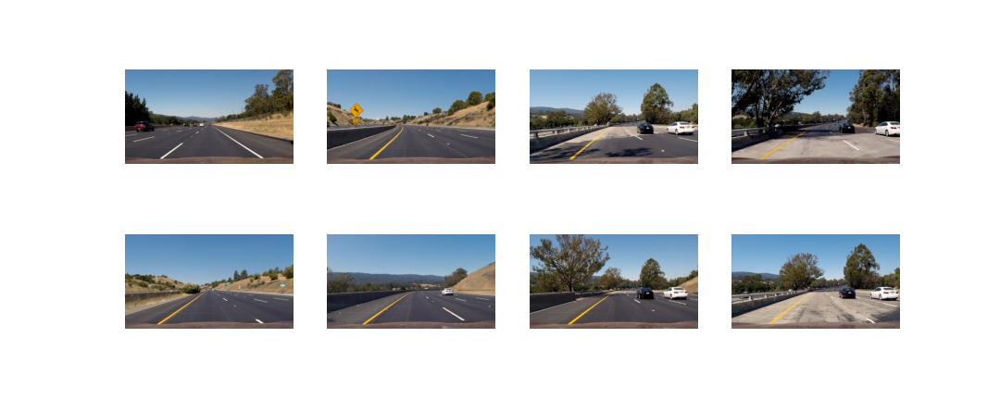

# **Lane Finding Project**

The goal of this project is to create a powerful pipeline to detect lane lines with raw images from a car's dash cam. The pipeline will visually display the lane boundaries, numerically giving a numerical estimate of the lane curvature.

# Dependencies 

**To execute the pipeline, the following dependencies are necessary :**

- numpy
- cv2
- glob
- matplotlib
- moviepy.editor

# The Project

**The goals / steps of this project are the following :**

- Compute the camera calibration matrix and distortion coefficients given a set of chessboard images.
- Apply a distortion correction to raw images.
- Use color transforms, gradients, etc., to create a thresholded binary image.
- Apply a perspective transform to rectify binary image ("birds-eye view").
- Detect lane pixels and fit to find the lane boundary.
- Determine the curvature of the lane and vehicle position with respect to center.
- Warp the detected lane boundaries back onto the original image.
- Output visual display of the lane boundaries and numerical estimation of lane curvature and vehicle position.

**Overview of Files :**

My project includes the following files :

- <a href= "README.md">README.md</a> (writeup report) documentation of the results
- <a href= "Camera_Calibration.ipynb">Camera_Calibration.ipynb</a> code for calibration of the camera
- <a href= "Color_transform_&_Gradient_Threshold.ipynb">Color_transform_&_Gradient_Threshold.ipynb</a> code for correction of distortion & calculation of thresholds & Color transform
- <a href= "Perspective_Transformation.ipynb">Perspective_Transformation.ipynb</a> code for perspective transformation
- <a href= "Lane_Finding_Project.ipynb">Lane_Finding_Project.ipynb</a> Code for all the project  
- <a href= "project_video_final.mp4">project video result</a>

# Camera Calibration

Each camera has a certain lens that distorts the captured image in a certain way compared to reality. Because we want to capture the view of the surroundings as accurately as possible, we have to correct this distortion. OpenCV provides some very useful functions to accomplish this task.

The code for this step  in the file called <a href= "Camera_Calibration.ipynb">Camera_Calibration.ipynb</a>.

I start by preparing **"object points"**, which will be the (x, y, z) coordinates of the chessboard corners in the world. Here I am assuming the chessboard is fixed on the (x, y) plane at z=0, such that the object points are the same for each calibration image. Thus, **objp** is just a replicated array of coordinates, and **objpoints** will be appended with a copy of it every time I successfully detect all chessboard corners in a test image. To do so I use the **cv2.findChessboardCorners()** function provided by OpenCV. **imgpoints** will be appended with the (x, y) pixel position of each of the corners in the image plane with each successful chessboard detection.

Here is an example of a successful detection:

I then used the output objpoints and imgpoints to compute the camera calibration and distortion coefficients using the cv2.calibrateCamera() function. I applied this distortion correction to the test image using the cv2.undistort() function and obtained this result:

The camera calibration and distortion coefficients are stored using pickle to be used on <a href= "Lane_Finding_Project.ipynb">the main notebook</a>

# Pipeline (single images)

I am now going to describe the pipeline each images goes through in order to detect the lines. I am going to display images to illustrate each steps of the way.

Here an exmples of images that I am going to use :

**1. Distortion correction**

The pictures of the chessboard were taken with the same camera as the one mounted on the car that took every pictures and videos that were provided for this project. Therefore, after calibrating the camera on the chessboard, we can use the same coefficients to undistort every images and videos of the road.

Using the camera matrix and distortion coefficients produced in the previous step, Here is the result after undistorting an image  using the OpenCV **undistort()** function.

**2. Lane detection**

I used a combination of color and gradient thresholds to generate a binary image where every non-zeros pixels have a high probability of being part of a lane line,In an order word to filter out potential noise (such as shadows, different color lanes, other cars, etc)

**2.1 Color thresholding**

Since the lines can be yellow and white, I chose to detect the lane lines by color as well. The S (saturation) channel of the HLS color space can be well suited for extracting a particular color.

The following image shows how I extract the yellow lines:

I found that extracting only the pixels between 90 and 255 would suit this problem quite well.
